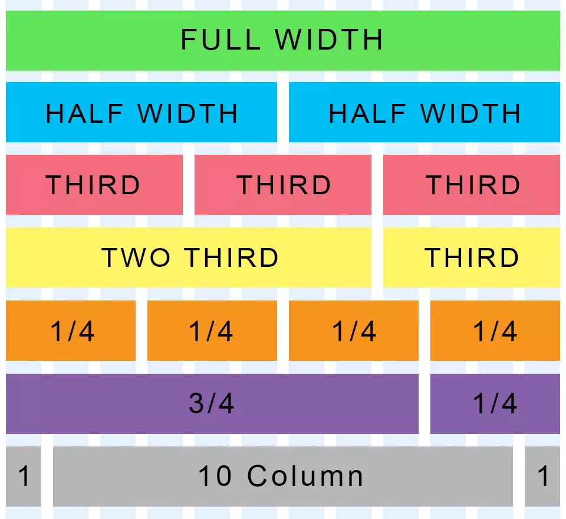

# Bootstap Layout 🎨

## Container

Container คือ Element พื้นฐานในการสร้าง Layout ตัวนึงที่ต้องใส่ทุกครัั้งก่อนจะใช้ระบบ Grid ใน Bootstrap

Container เอาไว้ใช้รวบ Elements หรือ Content ต่าง ๆ บนหน้าเว็บ และ Container สามารถที่จะซ้อนกันได้

## ชนิดของ Container

Container มีทั้งหมด 3 แบบ

1. `.container` จะ set max-width ของแต่ละ responsive breakpoint

2. `.container-fluid` จะ set ค่า width เป็น 100% ของทุก ๆ responsive breakpoint

3. `.container-{breakpoint}` จะ set ค่า width เป็น 100% ของ responsive breakpoint ที่กำหนด

## Grid

Grid เป็นระบบที่มาจัดวาง Layout ของตัว Content ของหน้าเว็บ จะใช้ Container, Row, และ Column มาประกอบกัน ซึ่ง Bootstrap จะใช้ระบบ Grid เป็น **12 Column System**

[Image Reference](http://atidyconcept.com/design-organized-websites-rapidly-960-grid/)

[ดูตัวอย่างเพิ่มเติมของ Grid ได้ที่นี่](https://getbootstrap.com/docs/5.0/examples/grid/#containers)
